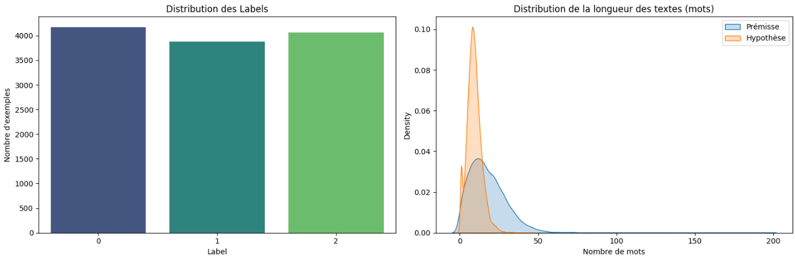
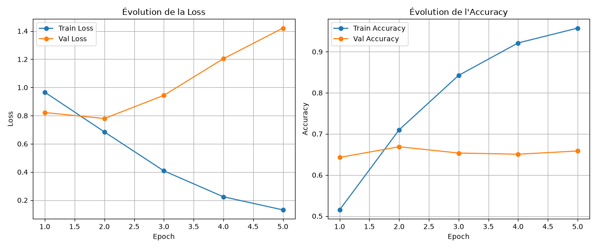
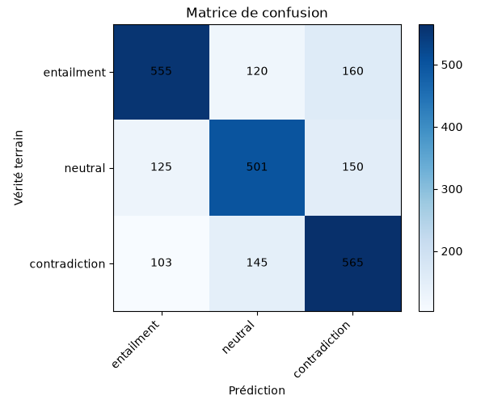
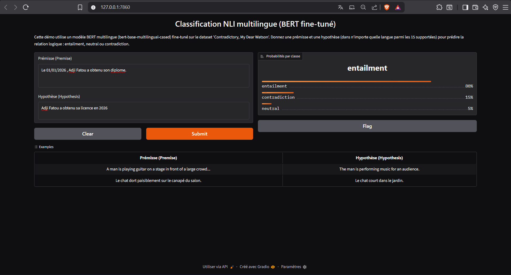
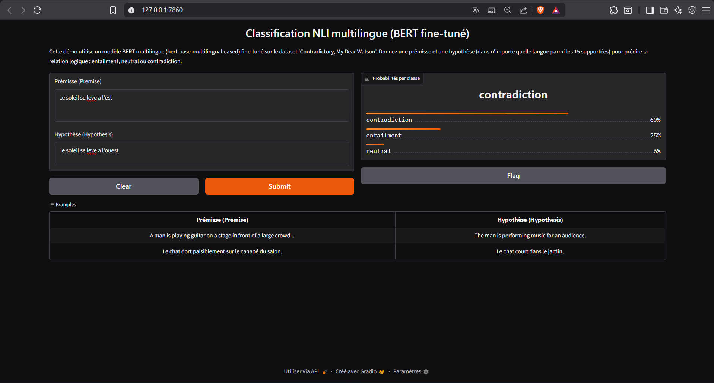
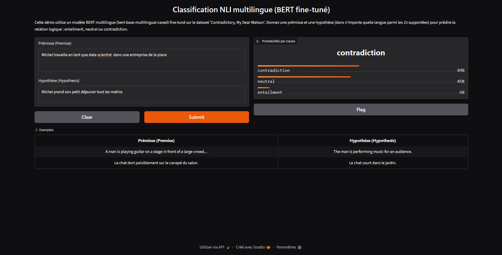

# Fine-Tuning de BERT pour la Classification de Texte (NLI Multilingue)

**Membres du binôme :** Adji Fatou Mahmoud Ibrahima MBAYE & N'dri Khan Michel KOUAKOU 
**Module :** Deep Learning (M2 IA)

---

## 1. Présentation du dataset & Analyse Exploratoire (EDA)

Le sujet choisi porte sur un problème d'implication textuelle multilingue. À partir d'une prémisse (`premise`) et d'une hypothèse (`hypothesis`), le modèle doit prédire la relation logique sous-jacente parmi trois classes possibles :
* **0 (Entailment / Implication)** : L'hypothèse découle nécessairement de la prémisse.
* **1 (Neutral / Neutre)** : L'hypothèse peut ou ne peut pas être vraie au vu de la prémisse.
* **2 (Contradiction)** : L'hypothèse contredit directement la prémisse.

Voici un aperçu de 3 exemples extraits du dataset illustrant la nature multilingue et les annotations :

| Prémisse | Hypothèse | Langue | Label (Classe) |
| :--- | :--- | :---: | :---: |
| *and these comments were considered in formulating the interim rules.* | *The rules developed in the interim were put together with these comments in mind.* | English | **0** (Implication) |
| *These are issues that we wrestle with in practice groups of law firms, she said.* | *Practice groups are not permitted to work on these issues.* | English | **2** (Contradiction) |
| *Des petites choses comme celles-là font une différence énorme dans ce que j'essaye de faire.* | *J'essayais d'accomplir quelque chose.* | French | **0** (Implication) |

---

### Statistiques Globales
* **Nombre total d'exemples :** 12 120 lignes
* **Nombre de classes :** 3 (0, 1, 2)
* **Nombre de langues représentées :** 15 langues (Dataset fortement multilingue avec une dominance de l'anglais, suivi du chinois, de l'arabe, du français, du swahili, de l'urdu, etc.)

### Visualisation de l'Analyse Exploratoire
Le script d'inspection a généré les distributions suivantes pour valider la structure de nos données d'entraînement :

* Le dataset est parfaitement équilibré.
* La distribution montre que la très grande majorité des prémisses et des hypothèses ont des longueurs concentrées entre 5 et 40 mots. 
* Les hypothèses (courbe orange) sont globalement plus courtes et plus concises que les prémisses (courbe bleue).
* *Choix du `max_length` :* En combinant les longueurs de la prémisse et de l'hypothèse (qui seront concaténées sous la forme `[CLS] Prémisse [SEP] Hypothèse [SEP]`), la longueur totale cumulée dépasse rarement 80 à 100 mots. Nous optons donc pour un hyperparamètre **`max_length = 128`** tokens. Ce choix permet d'éviter toute troncature d'information tout en minimisant le coût de calcul et l'empreinte mémoire sur le GPU.

---

## 2. Choix Techniques du Modèle

Compte tenu de la nature multilingue du jeu de données (15 langues distinctes), l'utilisation d'un modèle purement anglophone comme `bert-base-uncased` ou purement francophone comme `camembert-base` est fortuit. 

Nous sélectionnons le modèle **`bert-base-multilingual-cased` (mBERT)** pré-entraîné sur 104 langues, capable de capturer efficacement les structures syntaxiques et sémantiques des différentes langues de notre dataset.

--------------------------------------------------------------------------------------------------------------------------------

- **Modèle :** `bert-base-multilingual-cased` (choisi pour la couverture des 15 langues du dataset)
- **Tokenizer :** tokenization de paire (premise, hypothesis) → `[CLS] premise [SEP] hypothesis [SEP]`, avec `token_type_ids` pour distinguer les deux segments
- **max_length :** 128 (couvre ~99% des exemples, longueur combinée moyenne ≈ 27 mots)
- **Tête de classification :** `AutoModelForSequenceClassification` (dropout + couche dense linéaire sur l'embedding `[CLS]`, 3 sorties)
- **Optimiseur :** AdamW (lr=3e-5, weight_decay=0.01)
- **Scheduler :** linéaire avec warmup (10% des steps)
- **Batch size :** 32
- **Epochs :** 5
- **Loss :** CrossEntropyLoss (intégrée au modèle HF via `labels=...`)
- **Seed :** 42 (random, numpy, torch)

## 3. Étapes de réalisation et difficultés

### Étapes de réalisation

1. **Analyse du dataset** : inspection des colonnes (`premise`, `hypothesis`, `label`), vérification de la distribution des classes (équilibrée, ratio max/min ≈ 1.03), analyse des longueurs en tokens avec le vrai tokenizer pour justifier `max_length=128` (99e percentile = 125 tokens).

2. **Implémentation du pipeline** : création de `NLIDataset` avec tokenization de paires `[CLS] premise [SEP] hypothesis [SEP]` et gestion de `token_type_ids`, split stratifié 80/20, boucle d'entraînement manuelle PyTorch avec `train_epoch` / `eval_epoch`, sauvegarde du meilleur modèle sur `val_loss`.

3. **Choix du modèle** : `bert-base-multilingual-cased` retenu pour sa couverture des 15 langues du dataset.

4. **Entraînement et ajustement** : un premier entraînement à `lr=3e-5` a montré des signes d'overfitting (la `val_loss` remontait alors que la `train_loss` continuait de baisser). Pour y remédier, nous avons réduit le learning rate à `2e-5`, ajouté un `weight_decay=0.01` via AdamW et limité à 5 epochs.

5. **Démo Gradio** : interface permettant de saisir une paire (premise, hypothesis) en n'importe laquelle des 15 langues et d'afficher les probabilités des 3 classes.

### Difficultés rencontrées

- **Overfitting** : principal défi du projet. BERT converge très vite sur un dataset de ~10k exemples ; un LR de `3e-5` sur 5 epochs suffisait à mémoriser les données d'entraînement. Egalement nous avons essayer avec lr = 2e-5 sur 4 epoch, on a observé un overfiting.
- **Temps d'entraînement** : entraînement réalisé sur un PC avec GPU RTX 3050 4Gb VRAM ; chaque epoch prenait environ 18 minutes.

## 4. Résultats

- Courbes d'apprentissage : 

- Matrice de confusion :

- Metriques finales: 

**Train Loss:** 0.1312  | **Train Acc:** 0.9575
                                                                                                                
**Val Loss:**   1.4211 |  **Val Acc:**   0.6584 | **Val F1:** 0.6582

## 5. Démo Gradio

## 6. Installation et exécution

\`\`\`bash
### Cloner le repo
git clone <url-du-repo>
cd bert-classification-ContradictoryMyDearWatson

### Installer les dépendances
pip install -r requirements.txt

### Placer train 6.csv dans data/

### Entraînement
python train.py

### Lancer la démo
python demo.py
\`\`\`